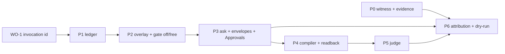

# The Policy Pillar — Architecture & Phased Build

**Status:** Draft for owner review · **Baseline:** `main @ af196cc` (2026-08-01)
**Predecessors:** `docs/AGENT_STUDIO_BACKEND_REQUIREMENTS.md` (AS-BE-003/004/005/006),
`docs/AGENT_STUDIO_LAUNCH_WORK_ORDERS.md` (WO-1 is this pillar's first brick)

## 1. Thesis

Natural-language policies become permissions, permissions become gates, gate
uncertainty triages into approvals, and everything lands as receipts. One
supply chain; each Agent Studio tab is a stage of it. The product claim this
enables: **the agent can be wrong, but it cannot be unauthorized.** Guidance
shapes the median; the gate bounds the tail; receipts prove which was which.

Verifiability framing: each phase makes agent operation more *resettable*
(ledgered inputs → replay), more *efficient* (dry-runs over recorded
invocations), and more *rewardable* (machine-scorable verdicts + witnessed
effects). Model improvements strengthen this platform (better compilers,
judges, agents under the same gates); they never obsolete it, because the
gates, ledger, and receipts are what make model work checkable.

## 2. Invariants

Numbered so PRs and reviews can cite them.

- **I1 — Never widen.** Policies only narrow the release's declared authority
  (manifest `read | internal_write | external_write`, runtime ceilings).
  No overlay, compile, or judge outcome may grant what the release didn't declare.
- **I2 — Fail closed.** Uncertainty → hold. Judge timeout/parse failure → hold.
  Compile ambiguity → save fails with the clarification question. Policy
  tightened while work is held → revalidate at approval; on conflict, deny.
- **I3 — Planes stay distinct.** Inbound caller grants (always/ask/never),
  release authority declarations, inference routing, and the owner's
  autonomous policy are four systems. UI and storage never conflate them
  (AS-BE-014/015). Caller permission requests live under GRANT, never in Approvals.
- **I4 — Enforce at effect chokepoints.** The gate binds where intent becomes
  execution (host dispatch) and where execution touches the world (platform
  channels). In-bundle function composition is invisible and free by design.
- **I5 — Artifacts are immutable and versioned; runs snapshot versions.**
  Policy sets version as one unit. Every gated invocation records the policy
  version it was judged under. Old runs keep their old bindings.
- **I6 — Receipts name their decider.** Every verdict records the layer
  (ceiling | overlay | predicate | judge | default), the rule reference, and —
  for judge verdicts — model identity + prompt version.
- **I7 — Alerts are pointers.** Promotion on impact, auto-resolve with cause,
  dedupe by cause. Objects live in their owning tab; Approvals holds gate
  holds only (a knowledge revision qualifies because it is a held
  `knowledge.set` call).
- **I8 — BYOK everywhere, structure from the platform.** Compiler and judge run
  on the user's models. The platform guarantees structure, not model quality:
  schema validation fails the save; the readback approval is the mandatory
  quality gate; compile-model identity is recorded in the version; judge model
  + prompt version pin per policy version.
- **I9 — Exactly-once execution.** A held invocation resumes from the ledger by
  claim, never by re-dispatch. Approval moves the *same* invocation
  held → queued; the consumer's optimistic claim (existing async_jobs
  machinery) remains the idempotency guard.
- **I10 — Sanitized projections.** Raw prompts, secrets, and unredacted args
  never reach owner surfaces. Envelopes carry sanitized `source`/`proposal`
  (the existing `LaunchApprovalEnvelope` contract already states this).

## 3. Object model

Existing contracts adopted as-is from `shared/contracts/launch.ts` (currently
consumed by nothing — the pillar is their consumer):

- `LaunchAutonomousFunctionPolicy` = `off | ask | free` (~L667 region)
- `LaunchFunctionConsequenceGroup` = `read | internal_write | external_side_effect | spend`
- `LaunchApprovalEnvelope` + `LAUNCH_APPROVAL_ACTIONS` (approve/revise/reject,
  `expectedRevision`, `idempotencyKey`) (~L735 region)

New objects (contracts added in their phase):

```
PolicySet      { appId, version, rules[], sourceTexts[], compiledBy: {model, at},
                 createdBy, status: draft|active|superseded }
Rule           { id, when: {function? | consequenceGroup?},
                 check: Predicate | Semantic | null,
                 effect: allow | hold | deny,
                 bindings: { inject?: bool, note? } }
Predicate      { path, op ∈ {eq,neq,gt,gte,lt,lte,in,not_in,domain_in,
                 matches_glob, rate_window(count,per), time_window(from,to,tz),
                 consequence_is}, value }
Semantic       { question, target: argPath, unsureMeans: hold,
                 judge: {modelId, promptVersion} }
Invocation     (ledger row; P1 extends async_jobs — see §5)
Verdict        { invocationId, layer: ceiling|overlay|predicate|judge|default,
                 ruleRef?, outcome: allow|hold|deny, judgeTranscriptHash? }
EffectEvent    { invocationId, seq, kind: function_started|function_completed|
                 function_failed|ai_exchange|db_mutation|email_dispatch|
                 notification|event_emit|http_request|non_action,
                 channel, targetDigest?, outcome,
                 attestation: attested|observed|app_claimed, evidence[] }
EvidenceRef    { kind: interface_link|external_url|platform_record,
                 target, label }
```

The attestation ladder is the honesty contract: **attested** (platform
witnessed the channel itself — managed email, db, ai), **observed** (platform
saw the request, not its meaning — raw HTTP domain+status), **app_claimed**
(the app said so — rendered as its account of itself, never as platform fact).

## 4. The gate

**Placement.** Two checkpoints, one policy set:

1. **Dispatch gate** — where an intended call becomes execution: the MCP
   `tools/call` execution path (the caller-gate region in
   `api/handlers/mcp.ts` ~L1977 is the in-repo precedent for
   "policy lookup → verdict → hold-with-pending-id"), and the queue consumer's
   claim point (`api/services/async-exec-consumer.ts`) so schedule, manual
   run-now, event, retry, and recovery paths all pass one evaluator.
   Content rules bind here too: generated content arrives as the *arguments*
   of the next call (a draft is `send_reply`'s `body`), so the judge inspects
   args at dispatch.
2. **Effect witness** — the platform channels (`galactic.ai`, `galactic.db`,
   managed email/notify, `emit`, `galactic.call`, raw fetch) emit
   `EffectEvent`s. P0 records; later phases may also *check* channel-level
   rules here (e.g., domain rules on fetch), still under I1.

**Evaluation order (dispatch gate).**

```
release ceiling (exists today — manifest declarations, runtime-enforced)
  → owner overlay (off | ask | free, per function; default from declarations)
  → compiled predicates (deterministic; first matching deny/hold wins)
  → semantic checks (judge; unsure → hold)
  → default allow
```

`off` → deny + structured `non_action` event. `ask`/predicate-hold/judge-hold →
invocation `held` + envelope minted. Approve → same invocation → `queued`
(exactly-once via claim, I9). Reject → `denied` + non-action. Revise →
**in-place** (ruled 2026-08-03, superseding the earlier lineage sketch):
the held invocation's input is replaced while still `held` — sealed the
moment it leaves that status — and the envelope re-records the sanitized
proposal and input hash atomically with the resolution, so the record shows
what was actually approved.

**Adopted decisions** (from the validated assessment + sessions):
manual "Run now" passes the same gate (execution principal is the agent);
policy carry-forward across releases only when the function's declaration hash
is unchanged, else reset to `ask`; approval granularity is the host-dispatched
invocation (no mid-stack resumption — verified: the sandbox has no continuation
serialization); expiry of a held envelope → `denied` + non-action + alert pointer.

## 5. Data model (phase-tagged sketches)

**P1 — ledger.** Extend `async_jobs` in place (it already owns durable claim
machinery, caller attribution, `hop`, and — after WO-1 — client invocation
identity). Additive columns:

```sql
ALTER TABLE public.async_jobs
  ADD COLUMN IF NOT EXISTS trigger text,            -- schedule|manual|event|interface|retry
  ADD COLUMN IF NOT EXISTS release_id uuid,
  ADD COLUMN IF NOT EXISTS policy_version integer,
  ADD COLUMN IF NOT EXISTS held_at timestamptz,
  ADD COLUMN IF NOT EXISTS resolved_at timestamptz;
-- status gains 'held' and 'denied' (widen the CHECK; consumer ignores both)
```

A `agent_invocations` view over it gives the pillar vocabulary without a
dual-write migration. Revisit a physical split only if volume demands it.

**P2 — overlay.**

```sql
CREATE TABLE public.agent_function_policies (
  app_id uuid NOT NULL, function_name text NOT NULL,
  policy text NOT NULL CHECK (policy IN ('off','ask','free')),
  declaration_hash text NOT NULL,          -- carry-forward key (I5, §4)
  revision text NOT NULL,                  -- CAS token
  set_by jsonb NOT NULL,                   -- LaunchAutonomousPolicyActor shape
  updated_at timestamptz NOT NULL DEFAULT now(),
  PRIMARY KEY (app_id, function_name)
);
```

**P3 — envelopes.** Mirror `LaunchApprovalEnvelope` exactly; `UNIQUE (run_id)`
(one envelope per held invocation); status from `LAUNCH_APPROVAL_STATUSES`;
actions require `expectedRevision` + `idempotencyKey` (contract already says so).

**P4 — policy sets.**

```sql
CREATE TABLE public.agent_policy_sets (
  app_id uuid NOT NULL, version integer NOT NULL,
  source jsonb NOT NULL,                   -- [{text, ruleIds[]}]
  artifact jsonb NOT NULL,                 -- compiled rules, schema-validated
  compile_model text NOT NULL,             -- I8: recorded, BYOK
  created_by uuid NOT NULL,
  created_at timestamptz NOT NULL DEFAULT now(),
  PRIMARY KEY (app_id, version)
);
-- immutability trigger, precedent: prevent_app_release_mutation
```

**P0 — effects.**

```sql
CREATE TABLE public.agent_effect_events (
  invocation_id uuid NOT NULL, seq integer NOT NULL,
  kind text NOT NULL, channel text,
  target_digest text, outcome text,
  attestation text NOT NULL CHECK (attestation IN ('attested','observed','app_claimed')),
  evidence jsonb NOT NULL DEFAULT '[]',
  created_at timestamptz NOT NULL DEFAULT now(),
  PRIMARY KEY (invocation_id, seq)
);
```

## 6. Compiler (P4)

- **Input:** owner's sentence(s) + the release's export schemas (arg paths and
  types come from the manifest — declaration quality sets policy resolution;
  Studio shows a per-function readiness hint: predicate-capable vs semantic-only).
- **Model:** the owner's BYOK route (I8). Identity recorded in the version.
- **Pipeline:** compile → schema-validate the artifact (unknown op, unknown
  path, type mismatch ⇒ **save fails** with precise errors) → deterministic
  readback rendered from the artifact by a code template (never by a model) →
  owner approves readback → version persisted immutable. A compiler that needs
  clarification must emit `clarification_needed` — surfaced as the save error.
- **Round-trip rule:** the user approves what will execute, not what they typed.

## 7. Judge (P5)

- Pinned per policy version: `{modelId, promptVersion}`; billed through the
  user's inference route when that model is available on it, platform-metered
  fallback otherwise — either way the receipt records what actually ran (I6).
- Schema-forced single enum `{allow | hold}` with `unsure ⇒ hold` folded in;
  bounded latency budget; timeout ⇒ hold (I2).
- Hardening: the judge sees content as data (no tools, no URLs followed);
  prompt-injection in inspected content can at worst cause a false *hold* —
  the failure mode is friction, never authorization.
- Receipt: verdict, rule id, transcript hash (not transcript).

## 8. Phases

Each phase ships alone, is user-visible or measurably de-risking, and ends
with a replayable fixture suite.

| Phase | Deliverable | Key touchpoints | User-visible | Est. |
|-------|------------|-----------------|--------------|------|
| **P0** | Effect witness + evidence SDK (`galactic.evidence()`), Activity upgrade to typed events with attestation labels | `runtime/sandbox.ts` (channel taps: ai/db exist — formalize; email/notify/emit/fetch), `agent_effect_events`, activity projection | "What changed in the world" + "decided not to do" sections, honestly labeled | 2–3 PRs |
| **P1** | Ledger unification: WO-1 id becomes ledger identity; trigger/release columns; `held`/`denied` statuses (dormant) | `async_jobs` migration, `async-jobs.ts`, `async-exec-consumer.ts`, view | none (foundation) | 2 PRs |
| **P2** | Overlay + dispatch gate with `off`/`free` (no holds yet): defaults from declarations, CAS routes, enforcement on every autonomous path | gate module `api/services/policy-gate.ts`, `mcp.ts` dispatch seam, consumer seam, overlay table + routes | Capabilities pane: per-function Off/Free with audit trail | 2–3 PRs |
| **P3** | `ask` + envelopes + **Approvals tab unhidden**; expiry; revise-lineage; tightened-policy revalidation | envelopes table + routes, gate hold path, Studio Approvals pane (mock exists), alert pointers for expiring holds | The Approvals tab, meaning one thing forever | 3 PRs |
| **P4** | Compiler + readback + policy sets; Directive tab v2 (versions, history); overlay folds in as compiled rules | policy sets table, compile service (BYOK), readback renderer, Directive pane | NL policies with versions + readback approval | 2–3 PRs |
| **P5** | Judge layer (semantic rules) | judge service, gate integration, receipts fields | "anything mentioning a lawyer"-class rules enforced | 2 PRs |
| **P6** | Attribution + counters + dry-run: per-rule "held 4 this week", policy-version diffs ("since v4 it escalated 6"), dry-run over recorded invocations | verdict/effect joins, dry-run harness replaying ledger inputs, Directive counters + "See them →" | Policies visibly earning their keep | 2–3 PRs |

Total ≈ 14–19 PRs. Dependency spine: P1 → P2 → P3; P0 independent (start
anytime, pairs well with launch); P4–P6 sequential after P3.



## 9. Decision register (final, 2026-08-01)

1. Everything BYOK — compiler and judge on the user's models; platform
   guarantees structure (validation, pinning, receipts), not model quality.
2. Approval granularity = host-dispatched invocation. No mid-stack resume.
3. Manual "Run now" passes the autonomous gate.
4. Carry policy forward across releases only on unchanged declaration hash;
   else reset to `ask`.
5. Held + policy tightened ⇒ revalidate at approve; fail closed.
6. Approvals tab = gate holds only; knowledge revisions qualify as held
   knowledge-mutation calls; caller grants stay in GRANT.
7. Alerts = impact-promoted, auto-resolving pointers; dedupe by cause.
8. Evidence is developer-curated on a typed ladder: attested / observed /
   app_claimed.
9. Enforcement at chokepoints; in-bundle composition free (I4).
10. Handoff TTL 60 min; durable machine auth is AS-BE-016, a separate stream.
11. Deferred, explicitly: inference-USD ledger + hard dollar ceiling;
    collaborators/retention/archive; full knowledge adapter contract;
    compute admission (own session); rollback-as-reissue (design agreed:
    forward re-release referencing an immutable prior artifact through the
    existing promotion validation; small schema allowance for releases minted
    from prior releases — build when demanded).

### 9.1 Amendments (2026-08-03, P3.5 hardening)

- **Decision 4 mechanics (ruled: enforce).** The gate compares the stored
  policy row's `declaration_hash` against the live declaration's hash at
  every evaluation (dispatch and claim). Mismatch downgrades non-`off`
  policies to **hold** — a `free` consent does not carry across a
  redeclaration. `off` is exempt: resetting a never-run to ask would widen
  (I1). Envelopes record the hash they were held under; approve-time
  revalidation (decision 5) refuses — without resolving — when the function
  is now `off` or was redeclared since filing, so the owner keeps agency
  over the pending envelope.
- **Revise shape (ruled: in-place).** See §4 — the lineage design is
  retired; `UNIQUE (run_id)` enforces one envelope per held invocation.
- **Claim checkpoint shipped.** The queue consumer evaluates the gate after
  the `queued → running` claim and before tenant code, for autonomous
  triggers only; jobs minted by an approved envelope (`meta.approvalHold`)
  skip it, and a `resuming` envelope for the same invocation IS the
  authorization on re-claim. Fail-closed: a broken gate parks the job as
  `held`, never executes past it.
- **Expiry settles fully**: envelope → `expired`, held job → `denied`,
  attested `non_action` witness line. The alert pointer remains deferred —
  no alerts stream exists yet to point from; it lands with that stream.

### 9.2 Amendments (2026-08-03, P5/P6 build)

- **Judge latency budget: 6s**, enforced via request abort; timeout ⇒ hold.
- **Semantic rules are hold-only by validation** — a model verdict gates
  for review, never irreversibly denies (deny stays deterministic).
- **Scoping posture**: every applicable semantic rule (exact function or
  `*`) rides ONE judge completion — the maximally generous inclusion of
  §13.5 (a false include costs part of one judge call). `suggest()`-based
  pruning and approvals-as-case-law appends activate when semantic-rule
  cardinality demands them; deferred explicitly, not silently.
- **Judge pin is minted at compile** from the owner's route model and
  approved as part of the readback; the envelope records the model that
  ACTUALLY ran + a transcript hash (never the transcript).
- **Dry-run semantic posture**: deterministic rules replay exactly through
  the production evaluator; semantic rules report scope ("would consult
  the judge") rather than paying N speculative judge calls for guessed
  verdicts.
- **Attribution source of truth is the envelope ledger** — the same rows
  the Approvals tab renders; no second bookkeeping to drift. Overlay
  (switch) holds attribute themselves in Capabilities.
- **Retention**: still deferred (decision 11) — volumes remain small;
  revisit when they are not.

## 10. Risks

| Risk | Mitigation |
|------|-----------|
| Judge latency on hot paths | latency budget + timeout⇒hold (I2); semantic rules are opt-in per policy; predicates carry the bulk |
| BYOK compile variance | validation floor + readback approval (I8); readiness hints steer schema quality |
| Double execution on resume | I9: approval flips the same row; consumer claim is the guard (existing machinery) |
| Envelope pile-up / expiry ambiguity | expiry ⇒ denied + non-action + alert pointer; counts on the tab |
| Prompt injection via inspected content | judge is toolless, schema-forced; worst case is a false hold |
| Ledger/effect volume | additive columns on an existing table; retention policy deferred deliberately (decision 11) — revisit at P6 with real volumes |
| Release/policy drift | declaration-hash carry-forward (decision 4) + I5 snapshots |
| Scope creep toward widening | I1 cited in review; gate has no allow-override path by construction |

## 11. Non-goals

USD ceilings, collaborators, retention/archive contracts, knowledge adapter
(agent-owned truth), compute admission, cross-agent policy inheritance,
policy marketplaces. Each is a future stream with its own doc when its time comes.

## 12. Verification strategy

Every phase lands with: (a) fixture invocations recorded as JSON (replayable),
(b) a dry-run harness test proving same-input-same-verdict across process
restarts, (c) fail-closed tests (timeout, parse failure, ambiguity), and
(d) receipts assertions that the decider layer is named (I6). The dry-run
harness from P6 is the same evaluator as production (one code path — the
assessment's requirement), which is what makes policy changes testable before
they govern anything real.

## 13. Design note — the Concept Graph (WO-6 now; P4/P5 consumer later)

Decisions locked 2026-08-02 with the owner. File-level projection:
`docs/AGENT_STUDIO_LAUNCH_WORK_ORDERS.md` WO-6. This section is the
decision record; the work order is the build plan.

### 13.1 Thesis

A per-agent graph of domain concepts, built as a **side effect of writing**,
consumed by retrieval now and by the gate later. Three edge layers, mapping
onto the attestation ladder (I-series invariants apply unchanged):

| Layer | Origin | Grade |
|---|---|---|
| Structural | Platform-recorded (receipts, answered-by, release provenance) | attested |
| Asserted | Written — `[[slug]]` mentions, `concept:` declarations, concept-page prose | claimed, with provenance |
| Semantic | Computed — embedding similarity, ranked with scores + model identity | observed; never stored as truth |

### 13.2 The notation contract

**Structure declares identity; prose declares association.**

- `[[slug]]` in any parsed prose = association. The mention's payload is its
  enclosing block (Roam's linked references). Unknown slugs auto-create
  `provisional` concepts — writing never errors.
- `concept: true` on a manifest schema field = identity; the field IS the
  concept named by its slugified field name. String form
  `concept: "other-slug"` = identity with a different name. Brackets never
  appear in identifiers; the key never appears in prose. (Considered and
  rejected: `x-concept` extension keys; empty-`[[]]`-in-description — both
  superseded by the dedicated key.)
- **Seeding:** the field's description copies onto the concept page only if
  the page is blank — one-time, never overwriting; first writer seeds on
  collisions. The manifest declares; the page lives.
- Slugs are immutable IDs (they live inside years of text); titles are
  mutable; merges are alias mappings — never text rewrites. Identity edges
  are re-asserted per release with release provenance; removing the key
  never cascade-deletes a concept (accrued case law survives).

### 13.3 Surfaces and blocks

Parsed surfaces: facts, questions, mission/policy text, memory, activity
summaries, function descriptions, schema field descriptions, concept pages,
and declared D1 text columns. Prose only; fenced code skipped. Blocks are
the surface's natural unit — Galactic's row/field-shaped stores mean the
chunking is already done; only memory and mission need a paragraph rule.
**The block is also the embedding chunk** — one boundary, both uses.
Mentions are derived: recomputed per surface on write, so edits self-heal.

D1 tiers: **v1** = manifest-declared columns parsed at the metered database
write chokepoint (ambient — the agent's ordinary CRUD is the indexing; the
injected concept glossary teaches it the vocabulary to bracket). **v1.5** =
unlinked-references view (verbatim search, promotable to mentions — a view,
never silent edges). **Deferred** = semantic sweep over tenant rows.

### 13.4 Retrieval primitives

- `about(slug)` — the assembled neighborhood: description, schema
  identities (release + arg path), fact/policy/memory/activity/D1 blocks,
  co-mentioned concepts. Layers labeled per the attestation ladder.
- `suggest(text)` — ranked candidate concepts for a text blob: verbatim and
  alias matches first (deterministic basis), then embedding similarity
  within one pinned model space. Callable by dev code (shapes the median)
  and, at P5, by the gate (shapes the tail) — same primitive, two callers.

Embeddings are BYOK (I8), inline on the concept row with
provider/model/text-hash recorded (the `agent_search_documents`
discipline); cross-model comparison is refused; re-embed-all is an explicit
maintenance action.

### 13.5 Pillar consumption (why this ships before P2)

- **P5 scoping:** the gate's "which semantic policies apply to this call's
  content" question is `suggest()` invoked by the platform — graded in,
  binary out (§4's evaluation order gains the scoping step there, not
  before). Generous inclusion threshold: false-include costs one judge
  call; false-exclude is a false allow.
- **P4 compiler:** `concept: true` identities give deterministic
  policy→function→arg-path binding — "hold [[refund]]s over €50" compiles
  against the declared path, and the readback can say so.
- **P3 case law:** approval resolutions append ruling lines to concept
  pages (prose → re-embed → better scoping; receipts linked via structural
  edge, never copied). Envelopes carry scoping evidence so rulings have a
  target.
- Sequencing: WO-6 precedes P0–P2 because it touches no gate machinery and
  every week the notation lives in the scaffold docs is a week third-party
  agents accumulate brackets — the gate arrives to a furnished house.

### 13.6 Non-goals (this stream)

Typed edges (revisit with P6 attribution), cross-agent graphs
(collaborators-era), auto-injection into `ai()` context, semantic D1
sweeps, unlinked-reference auto-linking, any gate integration before P5.
